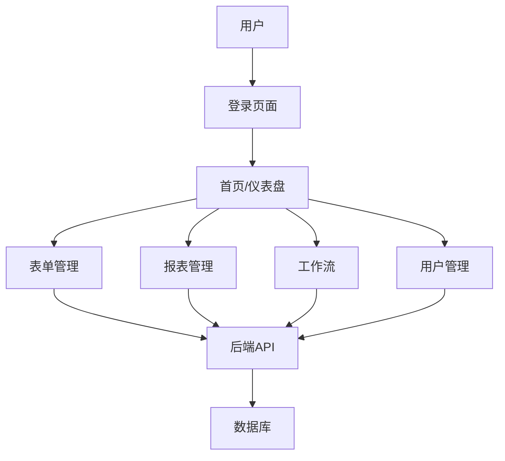

## 1. Product Overview
JEECG项目升级改造，将后端从Spring MVC升级到Spring Boot 3，同时保留原有前端功能，新增Vue 3 + Vite + Element Plus技术栈的现代化前端。
- 目标是提升系统性能、简化开发流程，同时保持业务逻辑和功能模块不变。
- 为用户提供更现代化、响应式的前端体验，同时确保后端架构更加健壮和可维护。

## 2. Core Features

### 2.1 User Roles
| Role | Registration Method | Core Permissions |
|------|---------------------|------------------|
| Admin | 系统预设 | 完全访问权限，包括用户管理、角色管理、菜单管理等 |
| Normal User | 管理员创建 | 基于角色的权限访问，只能访问授权的功能模块 |

### 2.2 Feature Module
1. **原有功能模块**：保持所有现有业务功能不变，包括表单管理、报表管理、工作流等核心模块。
2. **新前端模块**：基于Vue 3 + Vite + Element Plus构建的现代化前端，提供更好的用户体验。
3. **后端升级**：将Spring MVC架构升级到Spring Boot 3，优化性能和开发体验。

### 2.3 Page Details
| Page Name | Module Name | Feature description |
|-----------|-------------|---------------------|
| 登录页面 | 认证模块 | 用户登录、密码重置、验证码功能 |
| 首页 | 仪表盘 | 系统概览、待办事项、快捷操作 |
| 表单管理 | 表单设计 | 在线表单设计、表单配置、表单数据管理 |
| 报表管理 | 报表配置 | 在线报表配置、数据可视化、报表导出 |
| 工作流 | 流程设计 | 在线流程设计、流程实例管理、任务处理 |
| 用户管理 | 权限管理 | 用户管理、角色管理、权限配置 |

## 3. Core Process
用户登录系统后，可以根据权限访问不同的功能模块。管理员可以进行系统配置、用户管理等操作；普通用户可以使用授权的业务功能。后端处理所有业务逻辑，新旧前端通过API与后端交互。

## 4. User Interface Design
### 4.1 Design Style
- 主色调：#1890ff（蓝色）、#52c41a（绿色）
- 辅助色：#faad14（黄色）、#f5222d（红色）
- 按钮风格：圆角矩形，有 hover 和 active 状态效果
- 字体：系统默认字体，标题使用 16-20px，正文使用 14px
- 布局风格：卡片式布局，顶部导航栏，左侧菜单，右侧内容区
- 图标风格：使用 Element Plus 内置图标库

### 4.2 Page Design Overview
| Page Name | Module Name | UI Elements |
|-----------|-------------|-------------|
| 登录页面 | 认证模块 | 简洁的登录表单，包含用户名、密码输入框，验证码，登录按钮，忘记密码链接 |
| 首页 | 仪表盘 | 卡片式布局展示系统概览数据，包括待办任务、最近操作、系统状态等 |
| 表单管理 | 表单设计 | 拖拽式表单设计器，表单预览功能，表单数据列表和详情页 |
| 报表管理 | 报表配置 | 报表设计界面，数据可视化图表，报表导出按钮 |
| 工作流 | 流程设计 | 可视化流程设计器，流程实例列表，任务处理界面 |
| 用户管理 | 权限管理 | 用户列表，角色管理，权限配置界面 |

### 4.3 Responsiveness
采用响应式设计，支持桌面端、平板和移动端。在小屏幕设备上，左侧菜单会折叠为抽屉式菜单，内容区域会自适应调整布局。

### 4.4 3D Scene Guidance
不适用，本项目不包含3D场景。