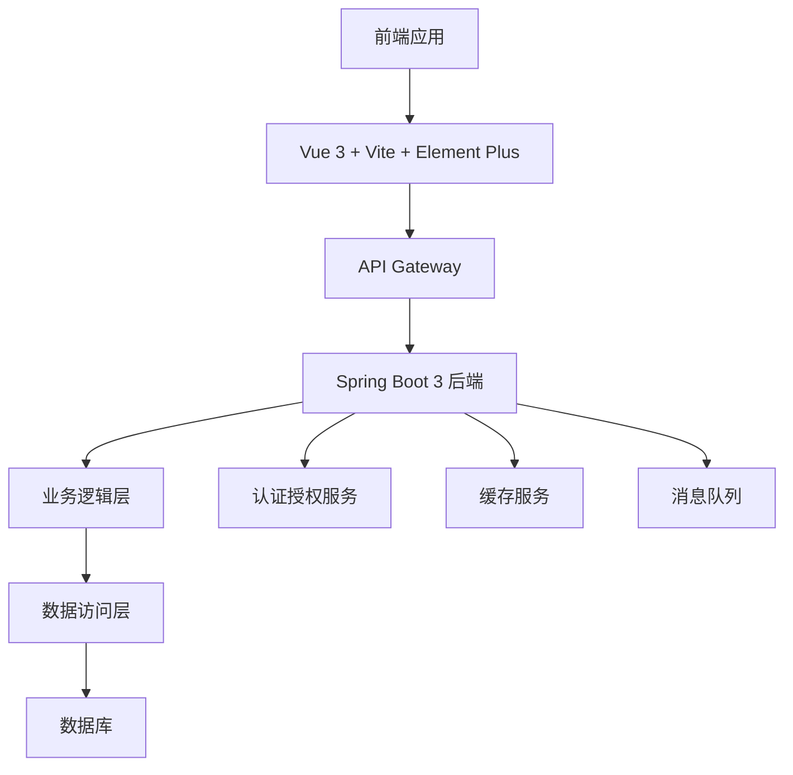
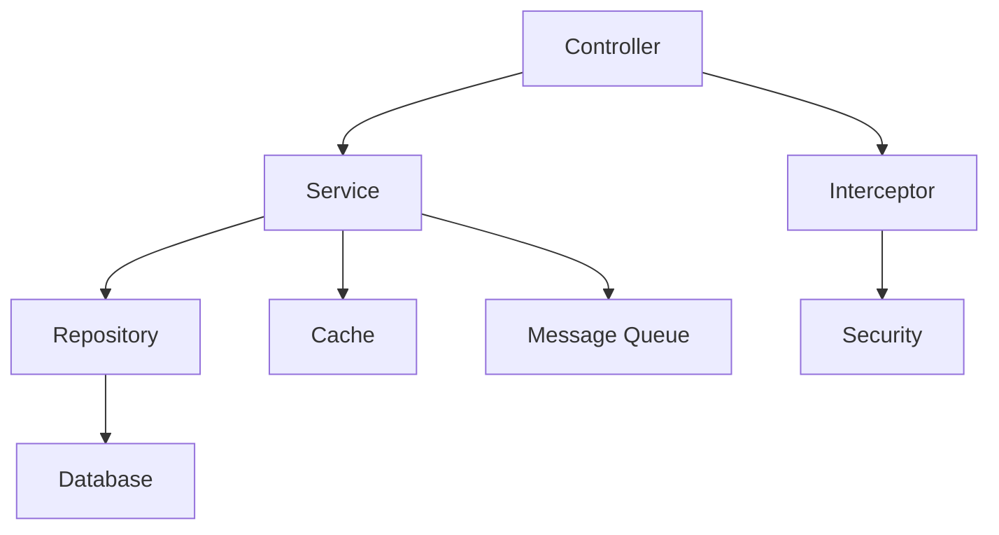
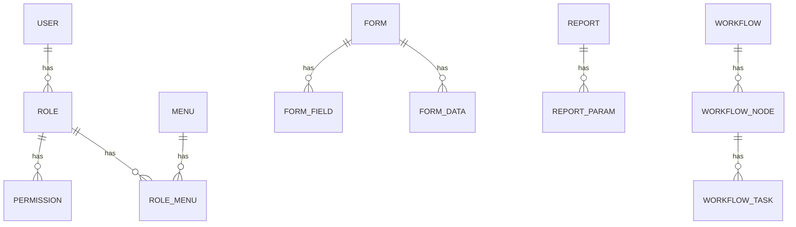

## 1. Architecture Design


## 2. Technology Description
- 前端：Vue 3 + Vite + Element Plus + TypeScript
- 构建工具：Vite
- 后端：Spring Boot 3 + Spring Security + Spring Data JPA
- 数据库：MySQL 5.7+
- 缓存：Redis
- 认证：JWT

## 3. Route Definitions
| Route | Purpose |
|-------|---------|
| / | 登录页面 |
| /home | 首页/仪表盘 |
| /form | 表单管理 |
| /report | 报表管理 |
| /workflow | 工作流管理 |
| /user | 用户管理 |
| /role | 角色管理 |
| /menu | 菜单管理 |

## 4. API Definitions
### 4.1 认证相关API
| API路径 | 方法 | 功能描述 | 请求体 | 响应体 |
|---------|------|----------|--------|--------|
| /api/auth/login | POST | 用户登录 | `{"username": "admin", "password": "123456"}` | `{"code": 200, "message": "success", "data": {"token": "...", "user": {...}}}` |
| /api/auth/logout | POST | 用户登出 | N/A | `{"code": 200, "message": "success"}` |
| /api/auth/refresh | POST | 刷新token | `{"refreshToken": "..."}` | `{"code": 200, "message": "success", "data": {"token": "..."}}` |

### 4.2 用户管理API
| API路径 | 方法 | 功能描述 | 请求体 | 响应体 |
|---------|------|----------|--------|--------|
| /api/user | GET | 获取用户列表 | N/A | `{"code": 200, "message": "success", "data": [{...}]}` |
| /api/user | POST | 新增用户 | `{"username": "...", "password": "...", "name": "..."}` | `{"code": 200, "message": "success", "data": {...}}` |
| /api/user/{id} | PUT | 更新用户 | `{"name": "...", "roleId": "..."}` | `{"code": 200, "message": "success", "data": {...}}` |
| /api/user/{id} | DELETE | 删除用户 | N/A | `{"code": 200, "message": "success"}` |

### 4.3 表单管理API
| API路径 | 方法 | 功能描述 | 请求体 | 响应体 |
|---------|------|----------|--------|--------|
| /api/form | GET | 获取表单列表 | N/A | `{"code": 200, "message": "success", "data": [{...}]}` |
| /api/form | POST | 新增表单 | `{"name": "...", "fields": [...]}` | `{"code": 200, "message": "success", "data": {...}}` |
| /api/form/{id} | PUT | 更新表单 | `{"name": "...", "fields": [...]}` | `{"code": 200, "message": "success", "data": {...}}` |
| /api/form/{id} | DELETE | 删除表单 | N/A | `{"code": 200, "message": "success"}` |
| /api/form/{id}/data | GET | 获取表单数据 | N/A | `{"code": 200, "message": "success", "data": [{...}]}` |

## 5. Server Architecture Diagram


## 6. Data Model
### 6.1 Data Model Definition


### 6.2 Data Definition Language
#### 用户表
```sql
CREATE TABLE `sys_user` (
  `id` varchar(32) NOT NULL,
  `username` varchar(50) NOT NULL,
  `password` varchar(100) NOT NULL,
  `name` varchar(50) NOT NULL,
  `email` varchar(100) DEFAULT NULL,
  `phone` varchar(20) DEFAULT NULL,
  `status` char(1) DEFAULT '1',
  `create_time` datetime DEFAULT NULL,
  `update_time` datetime DEFAULT NULL,
  PRIMARY KEY (`id`),
  UNIQUE KEY `username` (`username`)
) ENGINE=InnoDB DEFAULT CHARSET=utf8mb4;
```

#### 角色表
```sql
CREATE TABLE `sys_role` (
  `id` varchar(32) NOT NULL,
  `role_name` varchar(50) NOT NULL,
  `role_code` varchar(50) NOT NULL,
  `description` varchar(200) DEFAULT NULL,
  `create_time` datetime DEFAULT NULL,
  `update_time` datetime DEFAULT NULL,
  PRIMARY KEY (`id`),
  UNIQUE KEY `role_code` (`role_code`)
) ENGINE=InnoDB DEFAULT CHARSET=utf8mb4;
```

#### 用户角色关联表
```sql
CREATE TABLE `sys_user_role` (
  `id` varchar(32) NOT NULL,
  `user_id` varchar(32) NOT NULL,
  `role_id` varchar(32) NOT NULL,
  PRIMARY KEY (`id`),
  KEY `user_id` (`user_id`),
  KEY `role_id` (`role_id`)
) ENGINE=InnoDB DEFAULT CHARSET=utf8mb4;
```

#### 菜单表
```sql
CREATE TABLE `sys_menu` (
  `id` varchar(32) NOT NULL,
  `menu_name` varchar(50) NOT NULL,
  `parent_id` varchar(32) DEFAULT '0',
  `url` varchar(200) DEFAULT NULL,
  `perms` varchar(200) DEFAULT NULL,
  `type` char(1) DEFAULT '0',
  `icon` varchar(50) DEFAULT NULL,
  `order_num` int(11) DEFAULT '0',
  `create_time` datetime DEFAULT NULL,
  `update_time` datetime DEFAULT NULL,
  PRIMARY KEY (`id`)
) ENGINE=InnoDB DEFAULT CHARSET=utf8mb4;
```

#### 角色菜单关联表
```sql
CREATE TABLE `sys_role_menu` (
  `id` varchar(32) NOT NULL,
  `role_id` varchar(32) NOT NULL,
  `menu_id` varchar(32) NOT NULL,
  PRIMARY KEY (`id`),
  KEY `role_id` (`role_id`),
  KEY `menu_id` (`menu_id`)
) ENGINE=InnoDB DEFAULT CHARSET=utf8mb4;
```