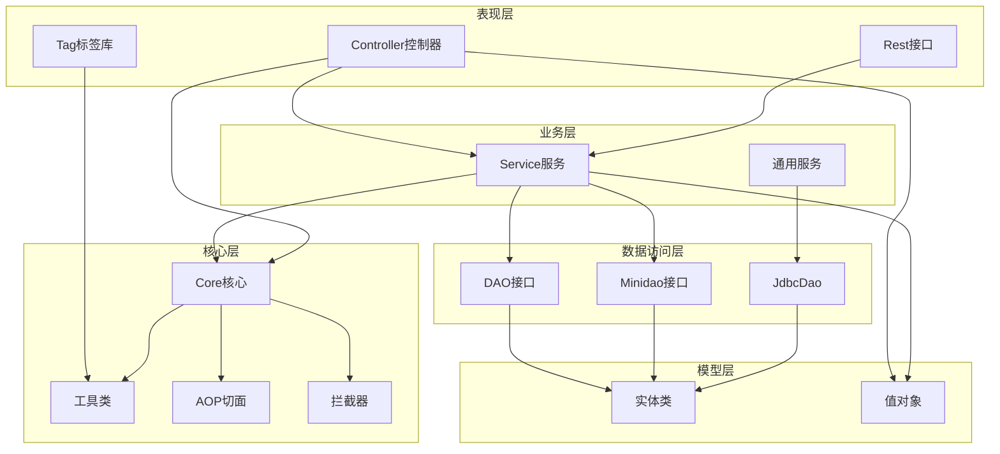

# JEECG 微云快速开发平台 - Code Wiki

## 1. 项目概述

JEECG（J2EE Code Generation）是一款基于代码生成器的智能开发平台，引领新的开发模式(Online Coding->代码生成器->手工MERGE智能开发)，可以帮助解决Java项目90%的重复工作，让开发更多关注业务逻辑。既能快速提高开发效率，帮助公司节省人力成本，同时又不失灵活性。

### 1.1 主要功能

- 代码生成器：支持单表和一对多表的增删改查功能自动生成
- Online Coding：在线配置实现表模型的增删改查功能，无需一行代码
- 工作流：集成 Activiti 流程引擎，实现在线画流程,自定义表单,表单挂靠,业务流转
- 自定义表单：支持用户自定义表单布局，支持单表，一对多表单、支持多种控件
- 报表：在线配置报表，无需编码实现曲线图，柱状图等
- 数据权限：精细化数据权限控制，控制到行级，列表级，表单字段级
- 国际化：支持多语言，开发国际化项目非常方便
- 多数据源：在线配置数据源，便捷的从其他数据抓取数据
- 移动平台：支持 Bootstrap(兼容Html5)，实现手机移动办公
- 插件机制：业务功能组件以插件方式集成平台，支持SAAS云应用需求
- 专业接口对接：统一采用restful接口方式，集成swagger-ui在线接口文档，Jwt token安全验证

### 1.2 技术栈

- **后端**：SpringMVC + Hibernate + Minidao(类Mybatis) + Ehcache + Redis
- **前端**：Easyui + Jquery + Boostrap + Ztree + Vue + Boostrap-table + ElementUI
- **数据库**：支持 Mysql, Oracle, Postgre, SqlServer
- **容器**：支持 Jetty, Tomcat, Weblogic
- **其他**：Activiti工作流、Swagger2接口文档、JWT认证

## 2. 项目架构

JEECG 采用经典的三层架构设计，同时融合了代码生成、在线配置等特色功能，形成了一套完整的快速开发体系。

### 2.1 架构分层

| 层次 | 职责 | 主要模块 | 位置 |
|------|------|----------|------|
| 表现层 | 处理用户请求，响应数据 | Controller、Tag标签库 | [org.jeecgframework.web](file:///workspace/src/main/java/org/jeecgframework/web)<br>[org.jeecgframework.tag](file:///workspace/src/main/java/org/jeecgframework/tag) |
| 业务层 | 实现业务逻辑 | Service | [com.jeecg.demo.service](file:///workspace/src/main/java/com/jeecg/demo/service)<br>[org.jeecgframework.web.*.service](file:///workspace/src/main/java/org/jeecgframework/web) |
| 数据访问层 | 数据库操作 | DAO、Minidao | [com.jeecg.demo.dao](file:///workspace/src/main/java/com/jeecg/demo/dao)<br>[org.jeecgframework.web.*.dao](file:///workspace/src/main/java/org/jeecgframework/web) |
| 核心层 | 通用功能、工具类 | Core | [org.jeecgframework.core](file:///workspace/src/main/java/org/jeecgframework/core) |
| 模型层 | 数据模型 | Entity | [com.jeecg.demo.entity](file:///workspace/src/main/java/com/jeecg/demo/entity)<br>[org.jeecgframework.web.*.entity](file:///workspace/src/main/java/org/jeecgframework/web) |

### 2.2 核心模块关系



## 3. 核心模块

### 3.1 核心层 (Core)

核心层是整个平台的基础，提供了各种通用功能和工具类，为其他模块提供支持。

#### 3.1.1 基础组件

- **BaseController**：所有控制器的基类，提供了通用的方法和属性
- **IdEntity**：所有实体类的基类，提供了通用的ID和时间戳属性
- **CommonService**：通用服务接口，提供了通用的CRUD操作
- **GenericBaseCommonDao**：通用DAO实现，基于Hibernate实现了通用的数据库操作

#### 3.1.2 工具类

- **ContextHolderUtils**：上下文工具类，用于获取当前请求的上下文信息
- **ResourceUtil**：资源工具类，用于获取配置信息和资源文件
- **DateUtils**：日期工具类，提供了日期格式化和转换功能
- **StringUtil**：字符串工具类，提供了字符串处理功能
- **FileUtils**：文件工具类，提供了文件操作功能
- **UploadUtils**：上传工具类，提供了文件上传功能
- **JSONHelper**：JSON工具类，提供了JSON转换功能
- **MD5Util**：MD5工具类，提供了MD5加密功能
- **UUIDGenerator**：UUID生成工具类，提供了UUID生成功能

#### 3.1.3 拦截器

- **AuthInterceptor**：权限拦截器，用于拦截未授权的请求
- **LogInterceptor**：日志拦截器，用于记录请求日志
- **SqlInjectInterceptor**：SQL注入拦截器，用于防止SQL注入攻击
- **DateConvertEditor**：日期转换编辑器，用于转换日期类型

### 3.2 表现层 (Web)

表现层负责处理用户请求，响应数据，包括控制器、标签库和REST接口。

#### 3.2.1 控制器

- **JeecgDemoController**：示例控制器，展示了基本的CRUD操作
- **CgFormHeadController**：表单配置控制器，用于管理表单配置
- **CgReportController**：报表控制器，用于管理报表配置
- **GraphReportController**：图形报表控制器，用于管理图形报表
- **UserRestController**：用户REST接口控制器，提供了用户相关的REST接口

#### 3.2.2 标签库

- **DataGridTag**：数据网格标签，用于展示数据列表
- **FormValidationTag**：表单验证标签，用于验证表单数据
- **DictSelectTag**：字典选择标签，用于选择字典数据
- **UserSelectTag**：用户选择标签，用于选择用户
- **DepartSelectTag**：部门选择标签，用于选择部门
- **UploadTag**：上传标签，用于上传文件

### 3.3 业务层 (Service)

业务层负责实现业务逻辑，包括各种服务接口和实现。

#### 3.3.1 示例服务

- **JeecgDemoServiceI**：示例服务接口，定义了示例相关的业务方法
- **JeecgDemoServiceImpl**：示例服务实现，实现了示例相关的业务逻辑

#### 3.3.2 表单服务

- **CgFormFieldServiceI**：表单字段服务接口，定义了表单字段相关的业务方法
- **CgFormFieldServiceImpl**：表单字段服务实现，实现了表单字段相关的业务逻辑

#### 3.3.3 报表服务

- **CgReportServiceI**：报表服务接口，定义了报表相关的业务方法
- **CgReportServiceImpl**：报表服务实现，实现了报表相关的业务逻辑

### 3.4 数据访问层 (DAO)

数据访问层负责数据库操作，包括DAO接口、Minidao接口和JdbcDao。

#### 3.4.1 DAO接口

- **ICommonDao**：通用DAO接口，定义了通用的数据库操作方法
- **IGenericBaseCommonDao**：通用基础DAO接口，继承自ICommonDao，提供了更多的数据库操作方法

#### 3.4.2 Minidao接口

- **JeecgMinidaoDao**：示例Minidao接口，使用Minidao实现了数据库操作

#### 3.4.3 JdbcDao

- **JdbcDao**：基于JDBC的DAO实现，提供了基于SQL的数据库操作方法

### 3.5 模型层 (Entity)

模型层负责数据模型，包括实体类和值对象。

#### 3.5.1 实体类

- **JeecgDemoEntity**：示例实体类，定义了示例表的结构
- **CgFormHeadEntity**：表单配置实体类，定义了表单配置表的结构
- **CgreportConfigHeadEntity**：报表配置实体类，定义了报表配置表的结构

#### 3.5.2 值对象

- **AjaxJson**：AJAX响应值对象，用于返回AJAX响应数据
- **DataGrid**：数据网格值对象，用于返回数据网格数据
- **DataGridReturn**：数据网格返回值对象，用于返回数据网格查询结果

## 4. 关键类与函数

### 4.1 核心类

#### 4.1.1 BaseController

**位置**：[org.jeecgframework.core.common.controller.BaseController](file:///workspace/src/main/java/org/jeecgframework/core/common/controller/BaseController.java)

**功能**：所有控制器的基类，提供了通用的方法和属性，如获取当前用户、返回AJAX响应等。

**主要方法**：
- `getCurrentUser()`：获取当前用户
- `ajaxJson()`：返回AJAX响应
- `ajaxJson(String msg)`：返回带消息的AJAX响应
- `ajaxJson(boolean success, String msg)`：返回带成功状态和消息的AJAX响应

#### 4.1.2 CommonService

**位置**：[org.jeecgframework.core.common.service.CommonService](file:///workspace/src/main/java/org/jeecgframework/core/common/service/CommonService.java)

**功能**：通用服务接口，提供了通用的CRUD操作方法。

**主要方法**：
- `save(Object entity)`：保存实体
- `update(Object entity)`：更新实体
- `delete(Object entity)`：删除实体
- `findById(Class<T> clazz, String id)`：根据ID查找实体
- `findListByProperty(Class<T> clazz, String propertyName, Object value)`：根据属性查找实体列表

#### 4.1.3 GenericBaseCommonDao

**位置**：[org.jeecgframework.core.common.dao.impl.GenericBaseCommonDao](file:///workspace/src/main/java/org/jeecgframework/core/common/dao/impl/GenericBaseCommonDao.java)

**功能**：通用DAO实现，基于Hibernate实现了通用的数据库操作方法。

**主要方法**：
- `save(Object entity)`：保存实体
- `update(Object entity)`：更新实体
- `delete(Object entity)`：删除实体
- `findById(Class<T> clazz, String id)`：根据ID查找实体
- `findByProperty(Class<T> clazz, String propertyName, Object value)`：根据属性查找实体

#### 4.1.4 ContextHolderUtils

**位置**：[org.jeecgframework.core.util.ContextHolderUtils](file:///workspace/src/main/java/org/jeecgframework/core/util/ContextHolderUtils.java)

**功能**：上下文工具类，用于获取当前请求的上下文信息，如请求、响应、会话等。

**主要方法**：
- `getRequest()`：获取当前请求
- `getResponse()`：获取当前响应
- `getSession()`：获取当前会话
- `getSession(boolean create)`：获取当前会话，可指定是否创建
- `getUserSession()`：获取当前用户会话

#### 4.1.5 ResourceUtil

**位置**：[org.jeecgframework.core.util.ResourceUtil](file:///workspace/src/main/java/org/jeecgframework/core/util/ResourceUtil.java)

**功能**：资源工具类，用于获取配置信息和资源文件。

**主要方法**：
- `getContextPath()`：获取上下文路径
- `getSessionUserName()`：获取会话用户名
- `getSessionUser()`：获取会话用户
- `getSystempPath()`：获取系统路径
- `getConfigByName(String name)`：根据名称获取配置

### 4.2 业务类

#### 4.2.1 JeecgDemoController

**位置**：[com.jeecg.demo.controller.JeecgDemoController](file:///workspace/src/main/java/com/jeecg/demo/controller/JeecgDemoController.java)

**功能**：示例控制器，展示了基本的CRUD操作，包括列表查询、添加、编辑、删除等。

**主要方法**：
- `datagrid()`：获取数据网格数据
- `add()`：添加记录
- `edit()`：编辑记录
- `del()`：删除记录
- `get()`：获取记录详情

#### 4.2.2 CgFormHeadController

**位置**：[org.jeecgframework.web.cgform.controller.config.CgFormHeadController](file:///workspace/src/main/java/org/jeecgframework/web/cgform/controller/config/CgFormHeadController.java)

**功能**：表单配置控制器，用于管理表单配置，包括添加、编辑、删除表单配置等。

**主要方法**：
- `datagrid()`：获取数据网格数据
- `add()`：添加表单配置
- `edit()`：编辑表单配置
- `del()`：删除表单配置
- `get()`：获取表单配置详情

#### 4.2.3 CgReportController

**位置**：[org.jeecgframework.web.cgreport.controller.core.CgReportController](file:///workspace/src/main/java/org/jeecgframework/web/cgreport/controller/core/CgReportController.java)

**功能**：报表控制器，用于管理报表配置，包括添加、编辑、删除报表配置等。

**主要方法**：
- `datagrid()`：获取数据网格数据
- `add()`：添加报表配置
- `edit()`：编辑报表配置
- `del()`：删除报表配置
- `get()`：获取报表配置详情

### 4.3 工具类

#### 4.3.1 DateUtils

**位置**：[org.jeecgframework.core.util.DateUtils](file:///workspace/src/main/java/org/jeecgframework/core/util/DateUtils.java)

**功能**：日期工具类，提供了日期格式化和转换功能。

**主要方法**：
- `formatDate(Date date)`：格式化日期
- `formatDate(Date date, String format)`：格式化日期，指定格式
- `parseDate(String dateStr)`：解析日期字符串
- `parseDate(String dateStr, String format)`：解析日期字符串，指定格式
- `getDateBefore(Date date, int day)`：获取指定日期之前的日期
- `getDateAfter(Date date, int day)`：获取指定日期之后的日期

#### 4.3.2 StringUtil

**位置**：[org.jeecgframework.core.util.StringUtil](file:///workspace/src/main/java/org/jeecgframework/core/util/StringUtil.java)

**功能**：字符串工具类，提供了字符串处理功能。

**主要方法**：
- `isEmpty(String str)`：判断字符串是否为空
- `isNotEmpty(String str)`：判断字符串是否不为空
- `trim(String str)`：去除字符串首尾空格
- `equals(String str1, String str2)`：比较两个字符串是否相等
- `substring(String str, int start, int end)`：截取字符串

#### 4.3.3 FileUtils

**位置**：[org.jeecgframework.core.util.FileUtils](file:///workspace/src/main/java/org/jeecgframework/core/util/FileUtils.java)

**功能**：文件工具类，提供了文件操作功能。

**主要方法**：
- `copyFile(File srcFile, File destFile)`：复制文件
- `deleteFile(File file)`：删除文件
- `readFileToString(File file)`：读取文件内容为字符串
- `writeStringToFile(File file, String data)`：将字符串写入文件
- `getFileExtension(String fileName)`：获取文件扩展名

## 5. 依赖关系

### 5.1 核心依赖

| 依赖 | 版本 | 用途 | 位置 |
|------|------|------|------|
| spring | 4.0.9.RELEASE | 依赖注入、MVC框架 | [pom.xml](file:///workspace/pom.xml) |
| hibernate | 4.1.0.Final | ORM框架 | [pom.xml](file:///workspace/pom.xml) |
| minidao | 1.6.7 | 类Mybatis的持久层框架 | [pom.xml](file:///workspace/pom.xml) |
| easyui | - | UI库 | [src/main/webapp/plug-in/easyui](file:///workspace/src/main/webapp/plug-in/easyui) |
| jquery | - | JavaScript库 | [src/main/webapp/plug-in/jquery](file:///workspace/src/main/webapp/plug-in/jquery) |
| bootstrap | - | 前端框架 | [src/main/webapp/plug-in/bootstrap3.3.5](file:///workspace/src/main/webapp/plug-in/bootstrap3.3.5) |
| ehcache | 2.4.3 | 缓存框架 | [pom.xml](file:///workspace/pom.xml) |
| redis | 2.9.0 | 缓存数据库 | [pom.xml](file:///workspace/pom.xml) |
| activiti | - | 工作流引擎 | [pom.xml](file:///workspace/pom.xml) |
| swagger | 2.4.0 | API文档生成 | [pom.xml](file:///workspace/pom.xml) |
| jwt | 0.9.0 | 认证令牌 | [pom.xml](file:///workspace/pom.xml) |

### 5.2 数据库依赖

| 依赖 | 版本 | 用途 | 位置 |
|------|------|------|------|
| mysql-connector-java | 5.1.27 | MySQL驱动 | [pom.xml](file:///workspace/pom.xml) |
| sqljdbc4 | 4.0 | SQL Server驱动 | [pom.xml](file:///workspace/pom.xml) |
| ojdbc14 | 10.2.0.5.0 | Oracle驱动 | [pom.xml](file:///workspace/pom.xml) |
| druid | 1.1.9 | 数据库连接池 | [pom.xml](file:///workspace/pom.xml) |
| commons-dbcp | 1.4 | 数据库连接池 | [pom.xml](file:///workspace/pom.xml) |

### 5.3 工具依赖

| 依赖 | 版本 | 用途 | 位置 |
|------|------|------|------|
| fastjson | 1.2.31 | JSON处理 | [pom.xml](file:///workspace/pom.xml) |
| gson | 2.2.4 | JSON处理 | [pom.xml](file:///workspace/pom.xml) |
| commons-lang | 2.6 | 通用工具类 | [pom.xml](file:///workspace/pom.xml) |
| commons-io | 1.3.2 | IO操作 | [pom.xml](file:///workspace/pom.xml) |
| commons-fileupload | 1.3.3 | 文件上传 | [pom.xml](file:///workspace/pom.xml) |
| freemarker | 2.3.19 | 模板引擎 | [pom.xml](file:///workspace/pom.xml) |
| jeasypoi | 2.2.0 | Excel处理 | [pom.xml](file:///workspace/pom.xml) |
| pinyin4j | 2.5.1 | 拼音处理 | [pom.xml](file:///workspace/pom.xml) |

## 6. 项目运行

### 6.1 环境要求

- JDK 1.7+
- Maven 3.0+
- 数据库：MySQL 5.5+ / Oracle 11g / SQL Server 2008+ / PostgreSQL
- Web容器：Tomcat 7+ / Jetty 7+ / Weblogic

### 6.2 数据库配置

1. 创建数据库，执行数据库脚本：
   - MySQL：[docs/jeecg_4.0_mysql.sql](file:///workspace/docs/jeecg_4.0_mysql.sql)
   - Oracle：[docs/jeecg_4.0_oracle11g.dmp](file:///workspace/docs/jeecg_4.0_oracle11g.dmp)
   - SQL Server：[docs/jeecg_4.0_sqlserver2008.sql](file:///workspace/docs/jeecg_4.0_sqlserver2008.sql)

2. 修改数据库配置文件：[src/main/resources/dbconfig.properties](file:///workspace/src/main/resources/dbconfig.properties)

### 6.3 项目构建

使用Maven构建项目：

```bash
mvn clean install
```

### 6.4 项目部署

#### 6.4.1 部署到Tomcat

1. 将构建好的war包复制到Tomcat的webapps目录
2. 启动Tomcat
3. 访问：http://localhost:8080/jeecg

#### 6.4.2 使用Maven插件运行

使用Tomcat插件运行：

```bash
mvn tomcat7:run
```

使用Jetty插件运行：

```bash
mvn jetty:run
```

### 6.5 访问方式

- 登录地址：http://localhost:8080/jeecg
- 默认用户名：admin
- 默认密码：123456

## 7. 开发指南

### 7.1 代码生成器

JEECG提供了强大的代码生成器，可以根据数据库表自动生成实体类、DAO、Service、Controller和JSP页面。

**使用步骤**：
1. 登录系统，进入"代码生成器"模块
2. 选择数据库表，配置生成参数
3. 点击"生成代码"按钮，生成代码
4. 将生成的代码复制到项目中

### 7.2 Online Coding

Online Coding是JEECG的特色功能，可以通过在线配置实现表模型的增删改查功能，无需一行代码。

**使用步骤**：
1. 登录系统，进入"Online表单开发"模块
2. 点击"新建表单"按钮，配置表单信息
3. 配置表单字段和布局
4. 保存表单配置，系统自动生成增删改查功能

### 7.3 工作流

JEECG集成了Activiti工作流引擎，可以实现在线画流程、自定义表单、表单挂靠、业务流转等功能。

**使用步骤**：
1. 登录系统，进入"工作流"模块
2. 点击"流程设计器"按钮，在线绘制流程
3. 配置流程节点和表单
4. 发布流程，启动流程实例

### 7.4 报表配置

JEECG提供了在线报表配置功能，可以通过在线配置方式实现曲线图、柱状图、数据等报表。

**使用步骤**：
1. 登录系统，进入"报表配置"模块
2. 点击"新建报表"按钮，配置报表信息
3. 配置报表SQL和参数
4. 保存报表配置，系统自动生成报表

## 8. 配置管理

### 8.1 系统配置

系统配置文件位于：[src/main/resources/sysConfig.properties](file:///workspace/src/main/resources/sysConfig.properties)

主要配置项：
- `sys.title`：系统标题
- `sys.version`：系统版本
- `sys.company`：公司名称
- `sys.copyright`：版权信息
- `sys.login.title`：登录页面标题

### 8.2 数据库配置

数据库配置文件位于：[src/main/resources/dbconfig.properties](file:///workspace/src/main/resources/dbconfig.properties)

主要配置项：
- `jdbc.url`：数据库连接URL
- `jdbc.username`：数据库用户名
- `jdbc.password`：数据库密码
- `jdbc.driver`：数据库驱动

### 8.3 Redis配置

Redis配置文件位于：[src/main/resources/redis.properties](file:///workspace/src/main/resources/redis.properties)

主要配置项：
- `redis.host`：Redis主机
- `redis.port`：Redis端口
- `redis.password`：Redis密码
- `redis.maxIdle`：最大空闲连接数
- `redis.maxTotal`：最大连接数

### 8.4 邮件配置

邮件配置文件位于：[src/main/resources/mail.properties](file:///workspace/src/main/resources/mail.properties)

主要配置项：
- `mail.host`：邮件服务器主机
- `mail.port`：邮件服务器端口
- `mail.username`：邮件用户名
- `mail.password`：邮件密码
- `mail.from`：发件人地址

## 9. 最佳实践

### 9.1 代码规范

- 类名：采用驼峰命名法，首字母大写
- 方法名：采用驼峰命名法，首字母小写
- 变量名：采用驼峰命名法，首字母小写
- 常量名：全部大写，单词之间用下划线分隔
- 包名：全部小写，单词之间用点分隔

### 9.2 开发流程

1. 需求分析：分析业务需求，确定功能点
2. 数据库设计：设计数据库表结构
3. 代码生成：使用代码生成器生成基础代码
4. 业务实现：根据业务需求实现业务逻辑
5. 测试：进行功能测试和性能测试
6. 部署：部署到生产环境

### 9.3 性能优化

- 使用缓存：对于频繁访问的数据，使用Ehcache或Redis进行缓存
- 数据库优化：合理设计数据库表结构，建立索引，优化SQL语句
- 代码优化：减少不必要的计算和操作，使用高效的算法和数据结构
- 服务器优化：合理配置服务器参数，提高服务器性能

### 9.4 安全措施

- 权限控制：使用JEECG的权限管理功能，控制用户对资源的访问
- 输入验证：对用户输入进行验证，防止SQL注入、XSS等攻击
- 加密处理：对敏感数据进行加密处理，如密码、身份证号等
- 日志记录：记录系统操作日志，便于审计和排查问题

## 10. 常见问题

### 10.1 数据库连接问题

**问题**：数据库连接失败
**解决方案**：
- 检查数据库服务是否启动
- 检查数据库连接配置是否正确
- 检查数据库用户名和密码是否正确
- 检查网络连接是否正常

### 10.2 代码生成问题

**问题**：代码生成失败
**解决方案**：
- 检查数据库表结构是否正确
- 检查代码生成配置是否正确
- 检查数据库连接是否正常

### 10.3 权限问题

**问题**：无权限访问某个功能
**解决方案**：
- 检查用户是否拥有该功能的权限
- 检查角色是否分配了该功能的权限
- 检查菜单是否配置了该功能的权限

### 10.4 性能问题

**问题**：系统运行缓慢
**解决方案**：
- 检查数据库是否有慢查询
- 检查系统是否有内存泄漏
- 检查服务器资源是否充足
- 检查代码是否有性能瓶颈

## 11. 总结

JEECG是一款功能强大的快速开发平台，通过代码生成器和Online Coding等特色功能，可以显著提高开发效率，减少重复工作。同时，JEECG提供了丰富的功能模块，如工作流、报表、表单等，可以满足各种企业应用的需求。

JEECG的设计理念是"简单功能由Online Coding配置出功能；复杂功能由代码生成器生成进行手工Merge；复杂流程业务采用表单自定义，业务流程使用工作流来实现"，这种设计理念使得JEECG既简单易用，又灵活强大。

通过本Wiki文档，您应该已经对JEECG有了全面的了解，包括项目架构、核心模块、关键类与函数、依赖关系、项目运行方式等。希望本文档能够帮助您更好地使用和开发JEECG项目。